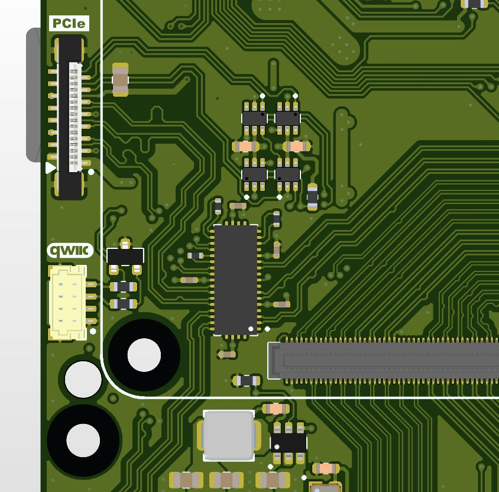
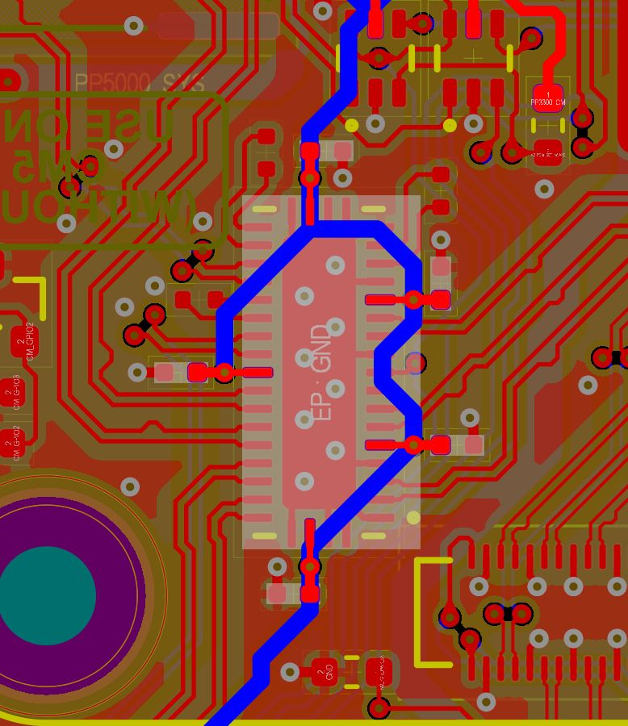
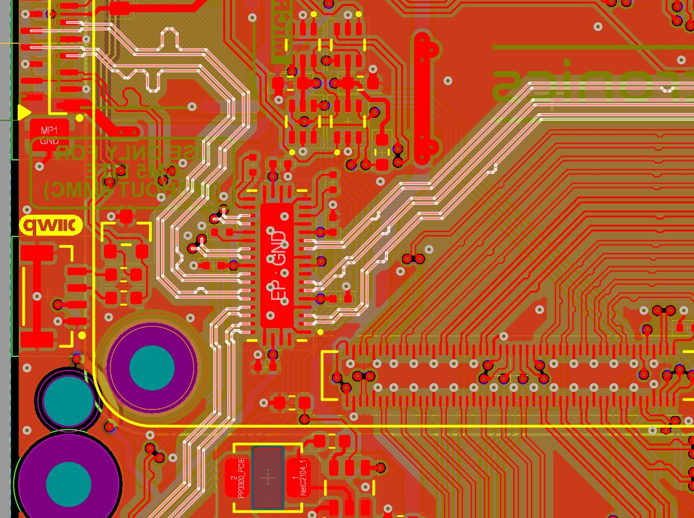
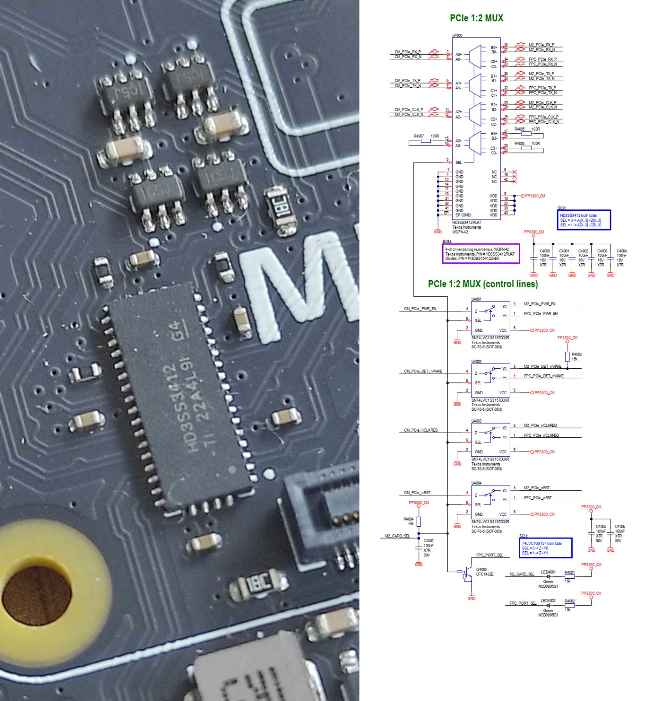
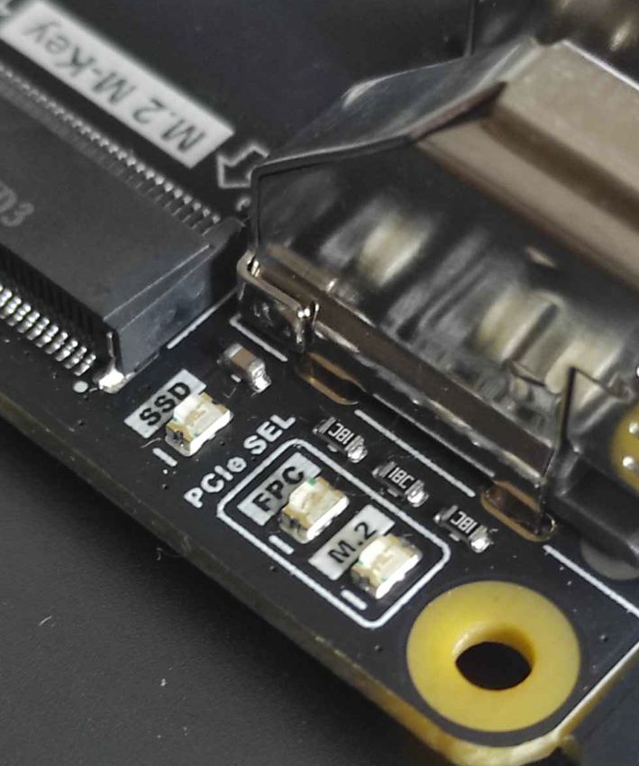
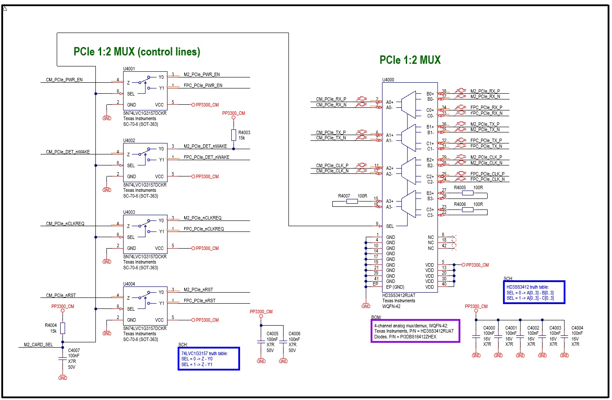
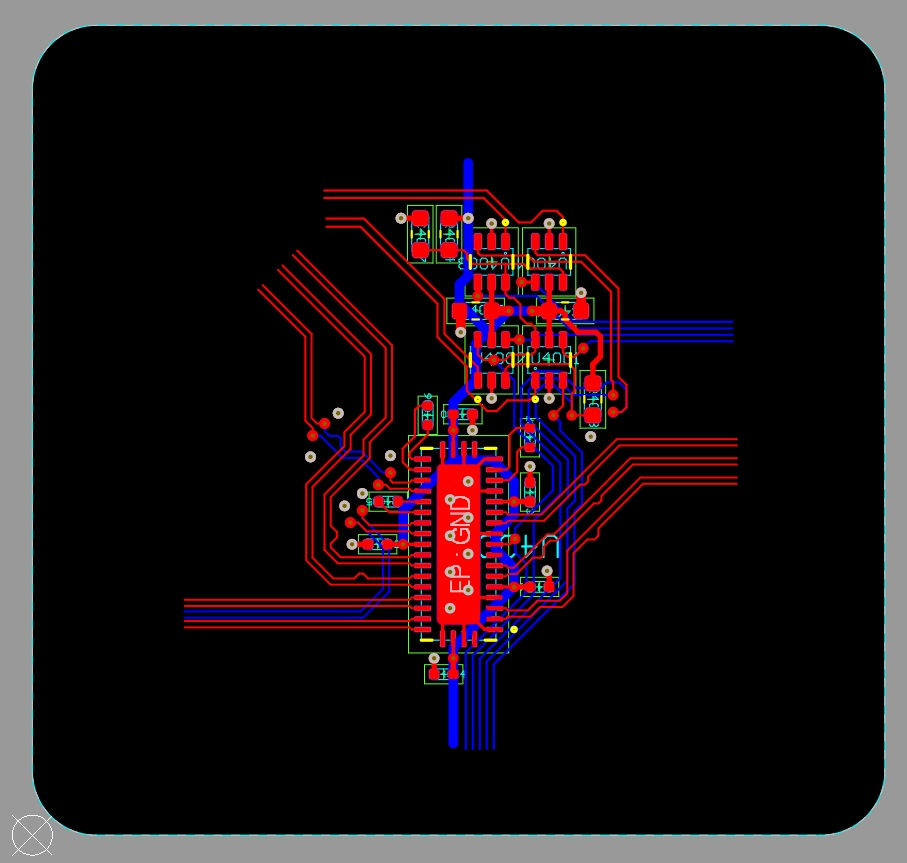

# PCIe Gen2/Gen3 Analog MUX 1:2 – Practical Implementation

### Overview
This repository contains a practical, fully tested implementation of a **1:2 PCIe Gen2/Gen3 analog multiplexer** circuit. It is designed for high-speed embedded systems and carrier boards that require switching a single PCIe lane between two independent endpoints while maintaining signal integrity at 5 GT/s (Gen2) or 8 GT/s (Gen3).

The high-speed differential signals (TX/RX/REFCLK) are multiplexed using the **Texas Instruments HD3SS3412**, a 4-channel differential switch supporting data rates up to 12 Gbps. Auxiliary control signals (PERST#, WAKE#, CLKREQ#) are handled by **SN74LVC1G3157** analog switches.

### Practical Application: MirkoPC Case Study
The implementation provided here is a key feature of the **MirkoPC** carrier board. The circuit automatically manages the PCIe interface:
*   **M.2 Mode:** If an NVMe drive is detected in the M.2 slot, the SoC's PCIe interface is automatically routed to the M.2 connector.
*   **HAT Mode:** If the slot is empty, the interface switches to the external HAT connector.
*   **Visual Feedback:** Two green LEDs indicate the currently active PCIe path (M.2 vs. HAT).

### PCB Design and Signal Integrity
The attached layout demonstrates professional high-speed routing techniques:
*   **Differential Pairs:** Routed with inter-pair spacing > 0.4 mm to minimize crosstalk.
*   **Intra-pair Matching:** The length difference between _P and _N lines is kept below 0.15 mm.
*   **Via Stitching:** When transitioning between L1 and L4 layers, two GND stitching vias are placed per differential pair to maintain a continuous return path and minimize impedance discontinuities.
*   **Routing Flexibility:** The design leverages PCIe features such as polarity inversion (_P/_N swap) to simplify routing and reduce via counts without affecting performance.

### Stackup and Power
The implementation uses a 4-layer stackup:
*   **L1:** Signal / Power
*   **L2:** Ground
*   **L3:** Ground
*   **L4:** Signal / Power
*   **Materials:** FR4 with 3313 Prepreg.
*   **Power:** The MUX consumes only 5–10 mA; 3.3V traces are 0.5 mm wide, and the exposed GND pad uses a via array for low-impedance grounding.

### Design Files and Format
The source files are provided in **Altium Designer** format, including the full schematic, PCB layout, and project settings.

#### KiCad Compatibility
KiCad users can easily import this project thanks to its native Altium importer. To do so:
1.  Open KiCad and go to **File > Import > Non-KiCad Project**.
2.  Select the Altium Project file (`*.PrjPcb`).
3.  Review design rules, net classes, and polygon pours after the import process to ensure all high-speed constraints are maintained.

#### Documentation Included
*   Schematics in **PDF** and **JPG** formats.
*   High-resolution PCB screenshots.
*   Photos of the practical implementation from the **MirkoPC** project.

### Disclaimer

This project is provided for educational and reference purposes only.

The hardware design, schematics, PCB layouts, documentation, and all accompanying files are provided **"AS IS"**, without warranty of any kind, express or implied, including but not limited to the warranties of merchantability, fitness for a particular purpose, and non-infringement.

Although every effort has been made to ensure the correctness of this design, the documentation and source files may contain errors, omissions, or inaccuracies. Users are solely responsible for verifying the design before manufacturing, assembly, or use in any application.

The author assumes no responsibility or liability for any direct, indirect, incidental, consequential, or special damages arising from the use of this project, including but not limited to hardware damage, data loss, financial loss, production failures, or personal injury.

Use this project entirely at your own risk.

### License
This project is released under the **CERN Open Hardware Licence Version 2 – Strongly Reciprocal (CERN-OHL-S-2.0)**.

License file: [Hardware License](LICENSE-HARDWARE.txt)

**What does this mean?**
The "Strongly Reciprocal" variant is the most robust version of the CERN license. It ensures that the hardware remains open. If you make modifications to these design files and distribute them (or products based on them), you are required to share those modifications under the same CERN-OHL-S license. This protects the project from becoming closed-source while allowing for commercial use, provided the spirit of open hardware is maintained.

---
*For more information on the implementation or hardware details, please refer to the documentation folder.*
